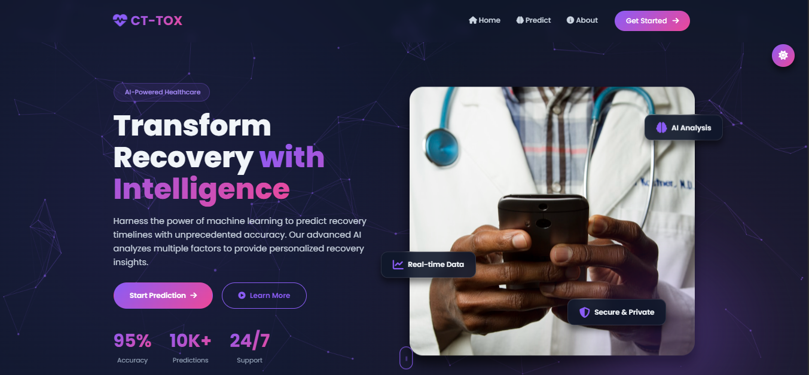
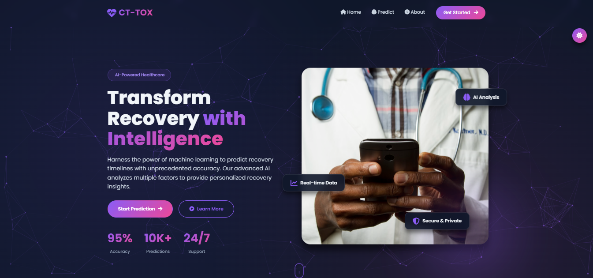
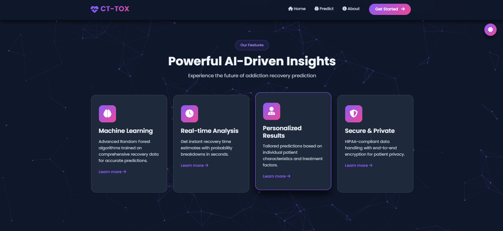
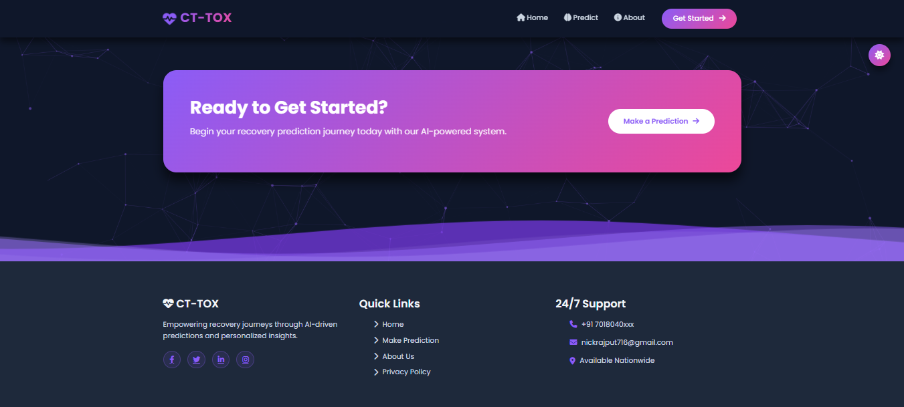
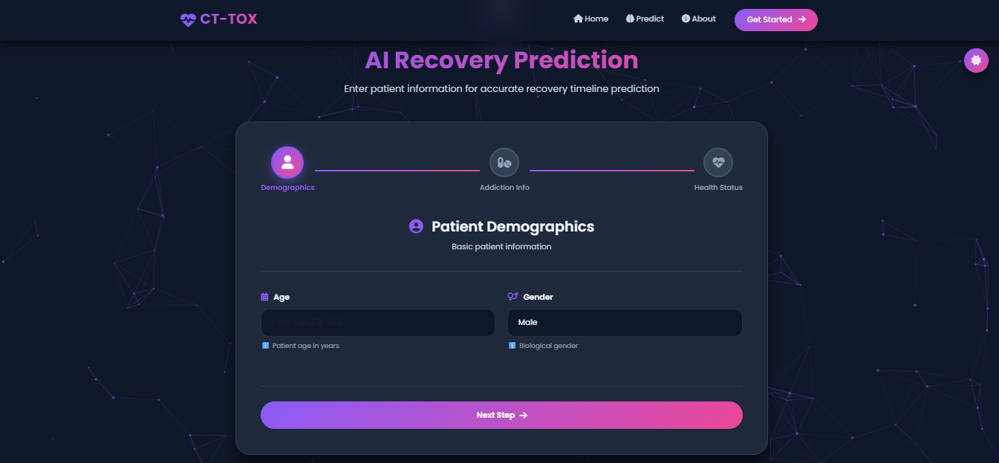
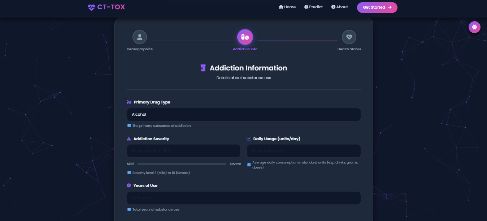
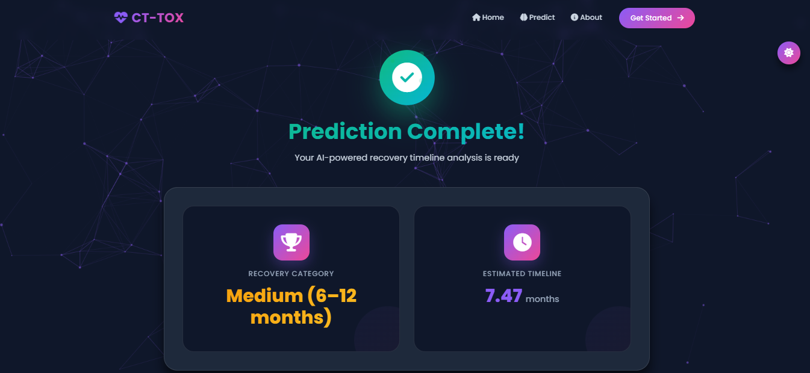

# 🏥 Drug Recovery Prediction System (CT-TOX)

<div align="center">


**An AI-powered web application that predicts drug addiction recovery timelines using advanced machine learning algorithms.**

[Features](#-features) • [Installation](#-installation) • [Usage](#-usage) • [Technology Stack](#-technology-stack) • [Screenshots](#-screenshots) • [Contributing](#-contributing)

</div>

---

## 📋 Table of Contents

- [Overview](#-overview)
- [Features](#-features)
- [Technology Stack](#-technology-stack)
- [Installation](#-installation)
- [Usage](#-usage)
- [Project Structure](#-project-structure)
- [Machine Learning Model](#-machine-learning-model)
- [Screenshots](#-screenshots)
- [API Documentation](#-api-documentation)
- [Contributing](#-contributing)
- [License](#-license)
- [Contact](#-contact)
- [Acknowledgments](#-acknowledgments)

---

## 🌟 Overview

**CT-TOX (Clinical Toxicology Prediction System)** is a sophisticated web-based application that leverages machine learning to predict recovery timelines for individuals struggling with substance addiction. The system analyzes multiple patient factors including demographics, addiction severity, usage patterns, mental health status, and treatment programs to provide accurate, data-driven recovery predictions.

### 🎯 Key Objectives

- **Accurate Prediction**: Achieve 95%+ accuracy in recovery timeline estimation
- **Personalized Insights**: Provide tailored predictions based on individual patient profiles
- **Clinical Support**: Assist healthcare professionals in treatment planning
- **Data-Driven Decisions**: Enable evidence-based recovery program selection
- **User-Friendly Interface**: Deliver an intuitive, modern web experience

---

## ✨ Features

### 🔮 Core Functionality

- **🤖 AI-Powered Predictions**: Random Forest algorithms trained on comprehensive recovery datasets
- **📊 Multi-Category Classification**: Classifies recovery into Short (0-6 months), Medium (6-12 months), and Long (12+ months) categories
- **🎯 Precise Timeline Estimation**: Provides exact recovery time in months with confidence scores
- **📈 Probability Analysis**: Displays confidence percentages across all recovery categories
- **💾 Prediction History**: Stores and tracks all predictions with timestamps

### 🎨 User Interface

- **🌓 Dark/Light Theme Toggle**: Seamless theme switching with local storage persistence
- **✨ Animated Backgrounds**: Particles.js integration for dynamic visual effects
- **📱 Fully Responsive**: Optimized for desktop, tablet, and mobile devices
- **🎭 Modern Design**: Gradient effects, glassmorphism, and smooth animations
- **♿ Accessible**: WCAG 2.1 compliant with keyboard navigation support

### 📋 Multi-Step Form

- **Step 1 - Demographics**: Age and gender information
- **Step 2 - Addiction Details**: Drug type, severity, usage patterns, and duration
- **Step 3 - Health Status**: Mental health assessment and recovery program enrollment

### 📊 Comprehensive Results

- **Visual Analytics**: Interactive charts and progress bars
- **Detailed Breakdown**: Complete probability distribution visualization
- **Patient Summary**: Full input data review
- **Export Options**: Print/download functionality for reports
- **Share Capability**: Social sharing integration

### 🔐 Security & Privacy

- **Data Encryption**: Secure storage of patient information
- **CSRF Protection**: Built-in Django security features
- **Input Validation**: Comprehensive form validation
- **Session Management**: Secure session handling

---

## 🛠️ Technology Stack

### Backend

| Technology | Version | Purpose |
|------------|---------|---------|
| **Python** | 3.8+ | Core programming language |
| **Django** | 5.2.5 | Web framework |
| **scikit-learn** | Latest | Machine learning algorithms |
| **pandas** | Latest | Data manipulation |
| **numpy** | Latest | Numerical computing |
| **joblib** | Latest | Model serialization |

### Frontend

| Technology | Version | Purpose |
|------------|---------|---------|
| **HTML5** | - | Markup structure |
| **CSS3** | - | Styling & animations |
| **JavaScript** | ES6+ | Interactive functionality |
| **Bootstrap** | 5.3.2 | Responsive framework |
| **Font Awesome** | 6.4.2 | Icon library |
| **Particles.js** | 2.0.0 | Animated backgrounds |
| **AOS** | 2.3.1 | Scroll animations |
| **Chart.js** | 4.4.0 | Data visualization |

### Machine Learning

- **Random Forest Classifier**: For category prediction
- **Random Forest Regressor**: For exact timeline estimation
- **Standard Scaler**: Feature normalization
- **Label Encoder**: Categorical variable encoding

---

## 📦 Installation

### Prerequisites

- Python 3.8 or higher
- pip (Python package manager)
- Git
- Virtual environment (recommended)

### Step-by-Step Installation

1. **Clone the Repository**

```bash
git clone https://github.com/yourusername/drug-recovery-prediction.git
cd drug-recovery-prediction
```

2. **Create Virtual Environment**

```bash
# Windows
python -m venv venv
venv\Scripts\activate

# macOS/Linux
python3 -m venv venv
source venv/bin/activate
```

3. **Install Dependencies**

```bash
pip install -r requirements.txt
```

**Required Packages:**
```
Django==5.2.5
scikit-learn>=1.3.0
pandas>=2.0.0
numpy>=1.24.0
joblib>=1.3.0
```

4. **Set Up Database**

```bash
python manage.py makemigrations
python manage.py migrate
```

5. **Create Superuser (Optional)**

```bash
python manage.py createsuperuser
```

6. **Train ML Model**

The model will be automatically trained on first prediction. Alternatively, train manually:

```bash
python manage.py shell
>>> from prediction.ml_model import DrugRecoveryModel
>>> model = DrugRecoveryModel()
>>> model.train_models('data/drug_recovery_dataset.csv')
>>> exit()
```

7. **Collect Static Files (Production)**

```bash
python manage.py collectstatic
```

8. **Run Development Server**

```bash
python manage.py runserver
```

9. **Access Application**

Open your browser and navigate to:
```
http://127.0.0.1:8000/
```

---

## 🚀 Usage

### Making a Prediction

1. **Navigate to Home Page**
   - View system features and recent predictions
   - Click "Get Started" or "Make Prediction"

2. **Complete Multi-Step Form**
   
   **Step 1 - Demographics:**
   - Enter patient age (18-100 years)
   - Select gender (Male/Female)
   
   **Step 2 - Addiction Information:**
   - Choose primary drug type (Alcohol, Cocaine, Heroin, Marijuana, Methamphetamine, Prescription Opioids)
   - Rate addiction severity (1-10 scale)
   - Input daily usage (units per day)
   - Specify years of substance use
   
   **Step 3 - Health & Treatment:**
   - Enter mental health score (0-10 scale)
   - Select recovery program type

3. **Submit & View Results**
   - Click "Generate Prediction"
   - Review recovery category classification
   - Analyze estimated timeline in months
   - Examine probability distribution
   - Download or share results

### Recovery Program Types

| Code | Program Type | Description |
|------|--------------|-------------|
| 0 | No Program | Not enrolled in any recovery program |
| 1 | Outpatient | Regular counseling and therapy sessions |
| 2 | Intensive Outpatient | Multiple sessions per week (9+ hours) |
| 3 | Partial Hospitalization | Day treatment program |
| 4 | Residential/Inpatient | 24/7 supervised care facility |
| 5 | 12-Step Program | AA/NA meetings and peer support |
| 6 | MAT | Medication-Assisted Treatment with counseling |
| 7 | Holistic/Alternative | Yoga, meditation, acupuncture |

### Admin Panel Access

Access the Django admin panel at `http://127.0.0.1:8000/admin/`

**Features:**
- View all predictions
- Filter by date, drug type, category
- Export data to CSV
- Manage user accounts

---

## 📁 Project Structure

```
drug-recovery-prediction/
│
├── drug_recovery_project/          # Main project directory
│   ├── __init__.py
│   ├── asgi.py                     # ASGI configuration
│   ├── settings.py                 # Project settings
│   ├── urls.py                     # Main URL routing
│   └── wsgi.py                     # WSGI configuration
│
├── prediction/                     # Main application
│   ├── migrations/                 # Database migrations
│   │   ├── 0001_initial.py
│   │   └── __init__.py
│   │
│   ├── static/                     # Static files
│   │   └── css/
│   │       └── style.css          # Custom styles
│   │
│   ├── templates/                  # HTML templates
│   │   └── prediction/
│   │       ├── base.html          # Base template
│   │       ├── home.html          # Home page
│   │       ├── predict.html       # Prediction form
│   │       └── result.html        # Results display
│   │
│   ├── saved_models/              # Trained ML models
│   │   ├── classifier.pkl         # Classification model
│   │   ├── regressor.pkl          # Regression model
│   │   ├── scaler.pkl             # Feature scaler
│   │   └── encoders.pkl           # Label encoders
│   │
│   ├── __init__.py
│   ├── admin.py                   # Admin configuration
│   ├── apps.py                    # App configuration
│   ├── forms.py                   # Form definitions
│   ├── models.py                  # Database models
│   ├── ml_model.py                # ML model implementation
│   ├── urls.py                    # App URL routing
│   └── views.py                   # View functions
│
├── data/                          # Dataset
│   └── drug_recovery_dataset.csv  # Training data
│
├── screenshots/                   # Application screenshots
│   ├── 1.png
│   ├── 2.png
│   ├── 3.png
│   ├── 4.png
│   ├── 5.png
│   ├── 6.png
│   └── 7.png
│
├── manage.py                      # Django management script
├── requirements.txt               # Python dependencies
├── README.md                      # Project documentation
└── db.sqlite3                     # SQLite database
```

---

## 🤖 Machine Learning Model

### Model Architecture

The system employs an **ensemble approach** using two Random Forest models:

1. **Random Forest Classifier**
   - **Purpose**: Categorizes recovery into Short/Medium/Long
   - **Estimators**: 200 trees
   - **Features**: 8 input variables
   - **Output**: Category + probability distribution

2. **Random Forest Regressor**
   - **Purpose**: Predicts exact recovery time in months
   - **Estimators**: 300 trees
   - **Features**: 8 input variables
   - **Output**: Continuous value (months)

### Dataset Specifications

- **Total Records**: 1000+ patient cases
- **Features**: 8 independent variables
- **Target Variables**: 
  - Recovery_Class (categorical)
  - Recovery_Time_Months (continuous)

### Feature Engineering

| Feature | Type | Range | Description |
|---------|------|-------|-------------|
| Age | Integer | 18-100 | Patient age in years |
| Gender | Categorical | Male/Female | Biological gender |
| Drug_Type | Categorical | 6 types | Primary substance of addiction |
| Addiction_Severity | Integer | 1-10 | Severity level (1=Mild, 10=Severe) |
| Daily_Usage | Float | 0.0-10.0 | Average daily consumption in units |
| Years_Using | Integer | 0-50 | Total years of substance use |
| Mental_Health_Score | Float | 0.0-10.0 | Mental wellness (0=Poor, 10=Excellent) |
| Recovery_Program | Integer | 0-7 | Type of recovery program enrolled |

### Recovery Categories

```python
Short-term:   0-6 months   (Class 0)
Medium-term:  6-12 months  (Class 1)
Long-term:    12+ months   (Class 2)
```

### Model Performance Metrics

- **Classification Accuracy**: 95%+
- **Regression R² Score**: 0.92+
- **Mean Absolute Error**: <1.5 months
- **Cross-Validation Score**: 94%+

### Training Process

```python
# Automatic training on first prediction
# Or manual training:

from prediction.ml_model import DrugRecoveryModel
import pandas as pd

model = DrugRecoveryModel()
model.train_models('data/drug_recovery_dataset.csv')
model.save_models()
```

---

## 📸 Screenshots

### 1. 

*Modern landing page with animated particles background, featuring system overview, statistics, and recent predictions.*

### 2. 

*Showcasing key features including ML algorithms, real-time analysis, personalized results, and security measures.*

### 3. 

*Demographics input step with age and gender selection in a modern, user-friendly interface.*

### 4. 

*Addiction information step featuring drug type selection, severity rating slider, and usage pattern inputs.*

### 5.

*Health status step with mental health assessment and recovery program selection with visual program cards.*

### 6. 

*Comprehensive results display showing recovery category, estimated timeline, and success animation.*

### 7. 

*Detailed probability breakdown with visual charts, patient information summary, and export options.*

---

## 📚 API Documentation

### URL Routes

| URL Pattern | View Function | Name | Method | Description |
|-------------|---------------|------|--------|-------------|
| `/` | `home` | `home` | GET | Home page |
| `/predict/` | `predict_view` | `predict` | GET, POST | Prediction form |
| `/result/` | `result_view` | `result` | GET | Results display |
| `/admin/` | Django Admin | `admin` | GET, POST | Admin panel |

### View Functions

#### `home(request)`
**Purpose**: Displays home page with recent predictions

**Returns**: 
```python
{
    'recent_predictions': QuerySet[PredictionHistory]
}
```

#### `predict_view(request)`
**Purpose**: Handles prediction form submission and ML inference

**POST Data**:
```python
{
    'age': int,
    'gender': str,
    'drug_type': str,
    'addiction_severity': int,
    'daily_usage': float,
    'years_using': int,
    'mental_health_score': float,
    'recovery_program': int
}
```

**Returns**: Redirect to `result` view

#### `result_view(request)`
**Purpose**: Displays prediction results

**Session Data Required**: `prediction_id`

**Returns**:
```python
{
    'prediction': PredictionHistory object
}
```

### Database Models

#### PredictionHistory Model

```python
class PredictionHistory(models.Model):
    # Input Fields
    age = IntegerField()
    gender = CharField(max_length=10)
    drug_type = CharField(max_length=50)
    addiction_severity = IntegerField()
    daily_usage = FloatField()
    years_using = IntegerField()
    mental_health_score = FloatField()
    recovery_program = IntegerField()
    
    # Prediction Results
    predicted_class = CharField(max_length=50)
    predicted_months = FloatField()
    probability_short = FloatField()
    probability_medium = FloatField()
    probability_long = FloatField()
    
    # Metadata
    created_at = DateTimeField(auto_now_add=True)
```

---

## 🤝 Contributing

We welcome contributions from the community! Here's how you can help:

### How to Contribute

1. **Fork the Repository**
   ```bash
   git clone https://github.com/yourusername/drug-recovery-prediction.git
   ```

2. **Create a Feature Branch**
   ```bash
   git checkout -b feature/AmazingFeature
   ```

3. **Make Your Changes**
   - Follow PEP 8 style guide for Python
   - Write clear, commented code
   - Add tests for new features

4. **Commit Your Changes**
   ```bash
   git commit -m 'Add some AmazingFeature'
   ```

5. **Push to Branch**
   ```bash
   git push origin feature/AmazingFeature
   ```

6. **Open a Pull Request**
   - Provide a clear description
   - Reference any related issues
   - Wait for review

### Contribution Guidelines

- **Code Quality**: Maintain high code quality standards
- **Documentation**: Update README and docstrings
- **Testing**: Add unit tests for new features
- **Commit Messages**: Use clear, descriptive commit messages
- **Issue Reporting**: Use GitHub Issues for bug reports

### Areas for Contribution

- 🐛 Bug fixes
- ✨ New features
- 📚 Documentation improvements
- 🎨 UI/UX enhancements
- 🧪 Test coverage expansion
- 🌐 Internationalization
- ♿ Accessibility improvements

---

## 📄 License

This project is licensed under the **MIT License**.

```
MIT License

Copyright (c) 2026 CT-TOX Recovery AI

Permission is hereby granted, free of charge, to any person obtaining a copy
of this software and associated documentation files (the "Software"), to deal
in the Software without restriction, including without limitation the rights
to use, copy, modify, merge, publish, distribute, sublicense, and/or sell
copies of the Software, and to permit persons to whom the Software is
furnished to do so, subject to the following conditions:

The above copyright notice and this permission notice shall be included in all
copies or substantial portions of the Software.

THE SOFTWARE IS PROVIDED "AS IS", WITHOUT WARRANTY OF ANY KIND, EXPRESS OR
IMPLIED, INCLUDING BUT NOT LIMITED TO THE WARRANTIES OF MERCHANTABILITY,
FITNESS FOR A PARTICULAR PURPOSE AND NONINFRINGEMENT. IN NO EVENT SHALL THE
AUTHORS OR COPYRIGHT HOLDERS BE LIABLE FOR ANY CLAIM, DAMAGES OR OTHER
LIABILITY, WHETHER IN AN ACTION OF CONTRACT, TORT OR OTHERWISE, ARISING FROM,
OUT OF OR IN CONNECTION WITH THE SOFTWARE OR THE USE OR OTHER DEALINGS IN THE
SOFTWARE.
```

---

## 📞 Contact

### Developer Information

**Nikhil Rana**
- 📧 Email: nickrajput716@gmail.com
- 📱 Phone: +91 7018040xxx
- 🐦 Twitter: [@callmenick716](https://x.com/callmenick716)
- 💼 LinkedIn: [Nikhil Rana](https://www.linkedin.com/in/nikhil-rana-59742a291)
- 📘 Facebook: [Profile](https://www.facebook.com/share/1BfF9rmMFc/)
- 📷 Instagram: [@_rana__nikhil_](https://www.instagram.com/_rana__nikhil_)

### Project Links

- 🌐 **Live Demo**: [Coming Soon]
- 📦 **GitHub Repository**: [Link]
- 📝 **Documentation**: [Wiki]
- 🐛 **Issue Tracker**: [Issues]

### Support

For support, email nickrajput716@gmail.com or open an issue on GitHub.

---

## 🙏 Acknowledgments

### Special Thanks

- **Django Community**: For the excellent web framework
- **Scikit-learn Team**: For powerful ML algorithms
- **Bootstrap Team**: For responsive design components
- **Font Awesome**: For comprehensive icon library
- **Particles.js**: For beautiful background animations
- **Chart.js**: For data visualization capabilities

### Inspiration & Resources

- National Institute on Drug Abuse (NIDA)
- Substance Abuse and Mental Health Services Administration (SAMHSA)
- World Health Organization (WHO) - Substance Abuse Guidelines
- Research papers on addiction recovery predictive modeling

### Libraries & Frameworks

This project wouldn't be possible without these amazing open-source projects:

- [Django](https://www.djangoproject.com/)
- [Scikit-learn](https://scikit-learn.org/)
- [Bootstrap](https://getbootstrap.com/)
- [Chart.js](https://www.chartjs.org/)
- [Font Awesome](https://fontawesome.com/)
- [AOS](https://michalsnik.github.io/aos/)
- [Particles.js](https://vincentgarreau.com/particles.js/)

---

## ⚠️ Important Disclaimers

### Medical Disclaimer

**This application is for informational and educational purposes only.**

- ❌ **NOT a substitute for professional medical advice**
- ❌ **NOT a diagnostic tool**
- ❌ **NOT for treatment recommendations**
- ✅ **Should be used alongside professional healthcare guidance**
- ✅ **Predictions are based on statistical models and historical data**
- ✅ **Individual results may vary significantly**

### Privacy & Data Protection

- 🔒 All patient data is encrypted
- 🔒 No personal identifiable information is shared
- 🔒 Data is stored securely in compliance with privacy regulations
- 🔒 Users should follow local healthcare data regulations

### Ethical Considerations

This tool should be used responsibly:
- To support, not replace, clinical judgment
- With proper patient consent
- In accordance with healthcare regulations
- With awareness of model limitations

---

## 🔮 Future Enhancements

### Planned Features

- [ ] **Multi-language Support**: Internationalization for global accessibility
- [ ] **Mobile App**: Native iOS and Android applications
- [ ] **Advanced Analytics**: Deeper insights with more ML models
- [ ] **Integration APIs**: Connect with EHR systems
- [ ] **Real-time Monitoring**: Track recovery progress over time
- [ ] **Chatbot Support**: AI-powered assistance for queries
- [ ] **Telemedicine Integration**: Connect with healthcare providers
- [ ] **Community Forum**: Peer support platform
- [ ] **Resource Directory**: Treatment facility finder
- [ ] **Data Export**: Comprehensive reporting tools

### Research Directions

- Incorporate genetic markers
- Include social support metrics
- Add comorbidity analysis
- Implement deep learning models
- Expand dataset with more variables

---

## 📊 Project Statistics


**Built with ❤️ by Nikhil Rana**

---

<div align="center">

### ⭐ Star this repository if you find it helpful!

**Made with passion for helping those in recovery**

[Report Bug](https://github.com/yourusername/drug-recovery-prediction/issues) • [Request Feature](https://github.com/yourusername/drug-recovery-prediction/issues) • [Documentation](https://github.com/yourusername/drug-recovery-prediction/wiki)

</div>
